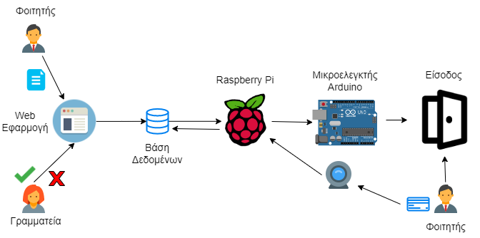
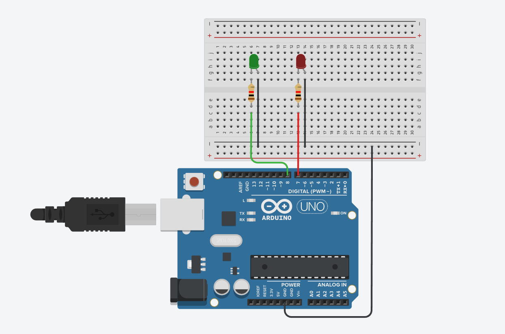

<center>
</center>

  

### Μια εργασία για τα Έξυπνα Περιβάλλοντα και Εφαρμογές

  Στα πλαίσια του μαθήματος υλοποιήθηκε μια εφαρμογή για την γρηγορότερη εξυπηρέτηση των φοιτητών και καλύτερη ιχνηλάτησα πιθανών κρουσμάτων. Οι φοιτητές μπαίνουν στην σελίδα του IonianPass καταχωρούν τα σχετικά δικαιολογητικά πιστοποιητικό εμβολιασμό κλπ. Στην συνεχεία η γραμματεία απορρίπτει ή αποδέχεται τους φοιτητές και όταν φτάσουν οι φοιτητές στην είσοδο σκανάρουν το φοιτητικό πάσο και σε περίπτωση που πληρούν τις προϋποθέσεις ανάβει το πράσινο Led ενώ σε οποιαδήποτε άλλη περίπτωση ανάβει το κόκκινο φωτάκι δηλαδή δεν έχει πρόσβαση στο Πανεπιστήμιο.




### Εξοπλισμός που απαιτείται

 -  Arduino Uno
 - 2 Led Λάμπες
 - 5 Καλώδια
 - 2 Αντιστάσεις 5 kΩ
 
  


### Οδηγίες Εγκατάστασης

```

git clone https://github.com/0xDockerman/SmartSystems-Assignment.git
cd SmartSystems-Assignment

source sql/database.sql

cd app
pip install -r requirements.txt
python3 barcode.py

```


  

 *Αναπτυχθηκε απο Αριστείδης Κοντίνης, Παναγιώτης Πιπής, Μιχαήλ Παναγιωτίδης*

